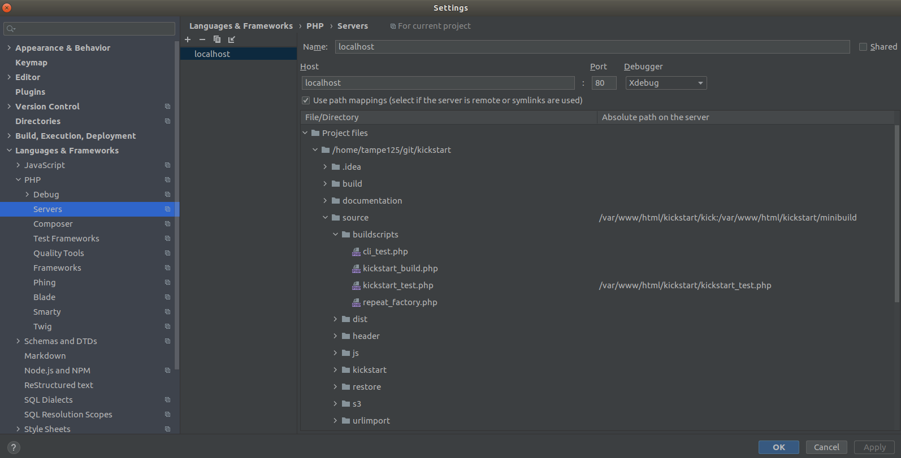

# Interactive debug in Kickstart

Debugging Kickstart web application in the browser with PhpStorm is tricky.  
We register a custom stream and let the Minibuild class do its magic, compiling and merging all the files
on the fly, without the need for us to manually trigger the compilation.  

That's pretty useful to speed up development, but the downside is that interactive debuggins is not available, since
PhpStorm can't follow the stream to find the file.  

However, we can set up a trick to make things work. I'm not sure if this is the intended behaviour, or we're bending the 
rules to our will, but at the time of this writing (November 2020) it's working fine.  

We have to set up a path mapping, using as Server Path the virtual path that includes the `kick:` keyword:  
  
  

That will do the trick, with only a small caveat: to intercept the debugging session you have to set up "hard"
breakpoints using `xdebug_break()` function, instead of PhpStorm "red dots".